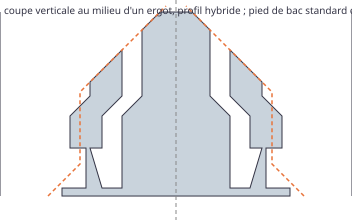

# Banc jetable : type CLICKbase, des lamelles qui serrent les bacs (ticket #27)

> Questions posées :
> - Quelle géométrie reprendre de CLICKbase Refined (Printables 1487592, ZeroCtrl), le point de départ fixé par le mainteneur, et comment l'adapter à nos deux profils de poche ?
> - Quel serrage donner à l'ergot ? On imprime trois serrages : 0,15, 0,25 (celui de Refined) et 0,35 mm.
> - Que deviennent les clips de découpe (#22), les aimants (#24), les numéros de pièce (#21) et les marges (#23) ?
>
> Le banc taille ses propres lamelles dans la Normal du moteur (voie booléenne, enveloppes convexes), mesure, dessine deux coupes, puis vérifie que le moteur construit exactement la variante retenue. C'est du code jetable : on ne le reprend pas tel quel.

## Relancer

```bash
# depuis la racine du dépôt (Vitest et manifold-3d du paquet du moteur)
pnpm --filter @repo/geometry exec vitest run --root ../../prototypes/clickbase
# relevé des cotes de Refined sur ses STL publics (réseau ; rien n'est gardé dans le dépôt)
node prototypes/clickbase/refined.mjs
```

`bench.test.ts` écrit `results.md`, les 3MF et les deux coupes SVG de `files/`. Il relit chaque 3MF et reconstruit chaque objet avec manifold (`NoError`).

## Ce que Refined fait, relevé sur ses STL

Les STL de Refined se téléchargent sans compte par l'API publique de Printables (`refined.mjs`). Coupe d'un côté de sa 1 × 1 (cellule de 42 mm, profil ras de 4,25 mm, chanfrein bas **conservé**), en mm depuis le centre de la cellule :

| z | À 6 mm du milieu du côté (lamelle droite) | À 10,5 mm (milieu de l'ergot) |
|---|---|---|
| 0,10 | 18,25 → 21,00 (base pleine) | 18,25 → 21,00 |
| 0,30 | 19,25 → 19,68 ; 19,95 → 21,00 | 18,75 → 19,18 ; 19,55 → 21,00 |
| 0,70 | 19,25 → 19,45 ; 20,15 → 21,00 | 18,75 → 18,95 ; 19,75 → 21,00 |
| 0,90 | 18,85 → 19,65 ; 20,15 → 21,00 | 18,65 → 19,15 ; 19,75 → 21,00 |
| 1,50 à 2,00 | 18,85 → 19,65 ; 20,15 → 21,00 | 18,35 → 19,15 ; 19,75 → 21,00 |
| 2,20 | 18,85 → 19,65 ; 20,15 → 21,00 | 18,55 → 19,35 ; 19,85 → 21,00 |
| 2,40 | 18,85 → 19,65 ; 20,15 → 21,00 | 18,75 → 19,55 ; 20,05 → 21,00 |
| 3,00 | 19,35 → 19,65 ; 20,15 → 21,00 | 19,35 → 19,65 ; 20,15 → 21,00 |
| 3,50 | 20,15 → 21,00 | 20,15 → 21,00 |

Lecture :

- **Lamelle** : un morceau de 0,80 mm de la paroi verticale de la poche (18,85 → 19,65), libéré du muret par une **saignée** de 0,50 mm derrière lui, sur 12 mm de long (4,50 → 16,50 le long du côté), tenu à ses deux bouts. Deux par côté, centrées à ±10,5 mm ; 1,70 mm de muret plein entre les saignées de deux cellules voisines.
- **Ergot** : ce n'est pas une bosse ajoutée, c'est la lamelle **cintrée** de 0,5 mm vers la poche, à épaisseur constante : un plat de 3 mm (9,0 → 12,0), des raccords de 1,4 mm de chaque côté ; en hauteur, plat de z = 1,2 à 2,0, puis retour à 45° dans la paroi à z = 2,5. Face de l'ergot à 18,35 : le pied d'un bac standard (18,60) est serré de 0,25 mm.
- **Imprimée en place** : la première couche est pleine sous la lamelle (z < 0,275). Au-dessus, une **toile** porte la lamelle : évidée de 0,4 mm côté poche (19,25), amincie côté saignée jusqu'à une arête d'environ 0,1 mm sous la lamelle (z = 0,875). Le premier bac casse cette arête (« use a rugged bin for the first use to break the detent clip free »).
- **Au milieu de chaque côté**, 9 mm restent pleins entre les deux lamelles ; la 1 × 1 y a une encoche pour ses propres clips (on garde les nôtres, #22).
- **Aimants** : aucun logement dans les STL (ils sont en option dans le fichier Onshape).

## Réponse

**La géométrie de Refined, adaptée à nos deux profils**, avec le serrage de Refined (0,25 mm). Le moteur construit exactement la variante retenue : même volume que le banc, sur la 2 × 2 comme sur le tiroir par défaut.

- **Reprises de Refined** : lamelle de 0,8 mm, saignée de 0,5 mm, 12 mm de long, deux par côté à un quart de la cellule, ergot cintré de 0,5 mm (plat de 3 mm, raccords de 1,4 mm, plat jusqu'à z = 2,0, puis 45°), toile évidée de 0,4 mm avec une arête de 0,1 mm, chanfrein bas de la poche **conservé** (Refined le garde ; extrabold, d'après le CLICKbase d'origine, le supprime).
- **Adaptations** :
  - le bas de la lamelle est le pied de la paroi verticale du profil, arrondi à la couche : 1,20 mm en hybride, 0,80 en ras (Refined : 0,875 en ras). La base pleine fait une couche arrondie (0,20 mm). L'ergot reste à la même hauteur absolue, puisque le pied d'un bac assis est à z = 0 dans les deux profils : il serre la bande verticale du pied (z = 0,8 à 2,6) ;
  - l'ergot est une **pyramide tronquée** (le décalage est le plus petit de ses deux rampes), à bas plat sur la toile (Refined : un chanfrein de 0,3 mm sous l'ergot) ;
  - la saignée garde 0,5 mm partout (Refined l'élargit à 0,6 mm derrière l'ergot) ; ses bouts sont droits (Refined : arrondis de 0,25 mm) ;
  - les lamelles suivent la taille de cellule : de 4,5 mm du milieu du côté à 0,5 mm avant l'arrondi de la poche, 12 mm au plus, centrées à un quart de la cellule ; sous 34 mm, une seule lamelle, centrée.
- **Matière** : × 0,84 (tiroir par défaut, 78,42 → 66,14 cm³) : la saignée et l'évidement retirent du muret.
- **Refined, comparé** : en profil ras et sans aimant, notre 2 × 2 fait 4,363 cm³ contre 4,268 cm³ pour la sienne (+2 %, surtout les encoches de ses clips).

Les coupes et les chiffres détaillés sont dans `results.md`.



## Clips, aimants, numéros, marges

- **Clips (#22)** : ils restent au milieu des côtés, dans les 9 mm pleins entre les lamelles ; la fente d'un clip (5 mm de long) ne croise aucune lamelle. Sur une cellule à lamelle unique (sous 34 mm), le clip est décalé hors de la lamelle, ou absent s'il n'y a pas la place (cellule de 20 mm). Tiroir par défaut coupé en 4 : 15 clips, comme la Normal.
- **Aimants (#24)** : conservés sous les croisements, loin des lamelles (4,6 mm entre le bout d'une saignée et l'axe du croisement, pour un logement de 3,25 mm de rayon).
- **Numéros de pièce (#21)** : gravés au milieu d'un côté, entre les lamelles. Un côté dont les chiffres atteindraient une lamelle n'en a pas (une cellule à lamelle unique, ou un numéro de 3 chiffres).
- **Marges (#23)** : pas de lamelle dans la marge, cellules entières et tronquées comprises (le plus économe). Un côté de cellule sur le contour garde ses lamelles tant que 0,8 mm de peau reste derrière la saignée, chanfrein du dessous compris.

## Fichiers à imprimer pour la recette (#16)

À imprimer en **PETG** (le PLA flue sous la contrainte permanente), générateur de parois **Arachne**, buse de **0,4 mm**, couches de 0,2 mm.

| Priorité | Fichier | Contenu | Ce qu'on juge |
|---|---|---|---|
| 1 | `files/banc-2x2-clickbase.3mf` | CLICKbase 2 × 2 du moteur, profil hybride, serrage 0,25, 1 aimant, 4,67 cm³ | L'enclenchement (un bac 1 × 1 dans chaque poche, puis un 2 × 2) : entre-t-il sans outil, avec un clic ? Le retrait : sort-il à la main, sans soulever la plaque ? Le premier bac casse-t-il les toiles ? Le fluage : laisser un bac une semaine dans une poche, une autre vide, et comparer la tenue. |
| 2 | `files/banc-2x2-clickbase-serrage-015.3mf` et `-035.3mf` | le même banc, serrages 0,15 et 0,35 | Quel serrage tient sans forcer : trop lâche, trop dur, les lamelles blanchissent-elles ? |
| 3 | `files/banc-2x2-clickbase-ras.3mf` | le moteur en profil ras (celui de Refined) | Le bac posé sur le tiroir, tenu par les seules lamelles, contre le profil hybride (assis sur ses pentes). |

On retrouve le banc 1 dans le générateur : mode « nombre de cellules », 2 × 2, type CLICKbase.
