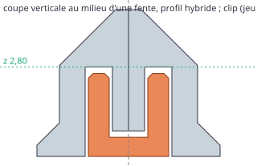

# Banc jetable : clips entre les pièces (ticket #22)

> Questions posées :
> - Une agrafe en U, insérée par-dessous dans le pied des murets, à cheval sur une coupe, tient-elle dans notre profil sans se voir de dessus ni entamer les poches ?
> - Quelle peau reste côté poche, aux hauteurs de référence du profil hybride et du profil ras ?
> - Quel jeu donner au clip ? On imprime un kit à 4 jeux gradués, à la manière du « Joint fit sample » de DrawerForge.
>
> Le banc taille ses propres fentes dans les pièces du moteur (`packages/geometry`, découpe de #21) ; le moteur reprend ensuite exactement la même fente (ADR 0010), ce que la dernière partie du banc vérifie. C'est du code jetable : on ne le reprend pas tel quel.

## Relancer

```bash
# depuis la racine du dépôt (Vitest et manifold-3d du paquet du moteur)
pnpm --filter @repo/geometry exec vitest run --root ../../prototypes/clips
```

`bench.test.ts` écrit `results.md`, les 3MF et les deux coupes SVG de `files/`. Il relit chaque 3MF avec le lecteur des tests du moteur, reconstruit chaque objet avec manifold, et s'arrête si un objet n'est pas `NoError`, si la peau côté poche descend sous 0,8 mm, ou si la matière retirée n'est pas exactement celle de la fente.

## « Sous la baseplate, impossible » ?

La recherche (`docs/research/decoupe-et-clips.md` § 3.5) écarte tout clip qui passerait **sous les poches** : elles sont ouvertes en dessous, et un bac assis descend jusqu'à z = 0 (ADR 0006). Le clip retenu ici est différent : il ne sort jamais de l'emprise du pied du muret. Au milieu d'un bord de cellule, le muret est plein sur ±2,15 mm autour de la coupe, de z = 1,05 à 2,85 mm (hybride), et plus large en dessous. La fente y occupe ±1,35 mm : il reste 0,8 mm de peau côté poche, et rien n'est retiré au-dessus de z = 2,80 mm. La remarque de la recherche reste vraie pour un clip sous les poches ; elle ne s'applique pas à un clip dans le pied du muret.

## Géométrie



De part et d'autre de la coupe, sur 5 mm de long, au milieu du bord de cellule :

- un **canal** sous la dent, sur ±1,35 mm, de z = 0 à 0,80 mm (arrondi à la couche supérieure) : le pont du clip y affleure le dessous ;
- une **fente de jambe** de chaque côté, de 0,50 à 1,35 mm de la coupe, jusqu'au pied de la pente haute de la poche, arrondi à la couche inférieure : 2,80 mm en hybride, 2,40 mm en ras (couches de 0,2) ;
- entre les deux fentes, la **dent** : 0,50 mm de matière que chaque pièce garde contre la coupe. Les jambes du clip l'enserrent : c'est ce qui empêche la coupe de s'ouvrir.

Le **clip** est la fente moins ses jeux : 0,1 mm par face en travers (spec), 0,25 mm à chaque bout, 0,2 mm en hauteur (le plafond de la fente et le dessous de la dent sont des ponts, qui peuvent s'affaisser un peu), et un chanfrein d'entrée de 0,15 mm en haut des jambes. Il s'imprime **couché sur le côté** : son profil en U dans le plan du plateau et sa longueur de 4,5 mm vers le haut, pour que chaque jambe soit un mur de lignes entières, solide là où elle travaille en flexion.

La fente est fixe ; seul le clip porte les jeux. Changer de jeu, c'est réimprimer des clips, jamais la baseplate.

Les tableaux ci-dessous sont repris de `results.md`.

## Peau restante côté poche

Matière le long d'une droite qui traverse la coupe au milieu d'une fente (pièce de gauche, la coupe en x = 0). Le « retrait de la poche » est la distance de la paroi de la poche au bord de la cellule.

| Profil | z (mm) | Retrait de la poche | Matière en x (mm) | Peau côté poche |
|---|---|---|---|---|
| hybride | 0,10 | 2,85 | −2,85 → −1,35 | 1,50 mm |
| hybride | 0,70 | 2,50 | −2,50 → −1,35 | 1,15 mm |
| hybride | 1,50 | 2,15 | −2,15 → −1,35 ; dent −0,50 → 0 | **0,80 mm** |
| hybride | 2,70 | 2,15 | −2,15 → −1,35 ; dent −0,50 → 0 | **0,80 mm** |
| hybride | 2,90 / 3,50 / 4,50 | 2,10 / 1,50 / 0,50 | muret plein jusqu'à la coupe | fente absente, section intacte |
| ras | 0,10 | 2,75 | −2,75 → −1,35 | 1,40 mm |
| ras | 0,50 | 2,35 | −2,35 → −1,35 | 1,00 mm |
| ras | 1,50 | 2,15 | −2,15 → −1,35 ; dent −0,50 → 0 | **0,80 mm** |
| ras | 2,30 | 2,15 | −2,15 → −1,35 ; dent −0,50 → 0 | **0,80 mm** |
| ras | 2,50 / 3,50 / 4,10 | 2,15 / 1,15 / 0,55 | muret plein jusqu'à la coupe | fente absente, section intacte |

- La peau la plus mince est de **0,80 mm**, soit deux lignes de 0,4 mm, sur la partie verticale de la poche. Elle est la même dans les deux profils : seule la hauteur de la fente change.
- Au-dessus du haut de la fente, les sections sont identiques à celles des pièces sans fente, à 10⁻⁶ mm² près : le clip est **invisible de dessus**, et les pentes où le bac s'assoit sont intactes.
- La matière retirée est exactement celle de la fente : 27,80 mm³ par clip en hybride, 24,40 mm³ en ras. Rien n'est pris sur une poche ni sur les numéros gravés.

## Clips du kit

| Profil | Jeu par face | Encombrement (mm) | Jambe | Écart des jambes | Pont | Volume | Ouverture possible de la coupe |
|---|---|---|---|---|---|---|---|
| hybride | 0,05 | 2,60 × 2,60 × 4,50 | 0,75 | 1,10 | 0,60 | 20,3 mm³ | 0,10 mm |
| hybride | **0,10** | 2,50 × 2,60 × 4,50 | 0,65 | 1,20 | 0,60 | 18,2 mm³ | 0,20 mm |
| hybride | 0,15 | 2,40 × 2,60 × 4,50 | 0,55 | 1,30 | 0,60 | 16,2 mm³ | 0,30 mm |
| hybride | 0,20 | 2,30 × 2,60 × 4,50 | 0,45 | 1,40 | 0,60 | 14,1 mm³ | 0,40 mm |
| ras | 0,05 à 0,20 | 2,60 à 2,30 × 2,20 × 4,50 | 0,75 à 0,45 | 1,10 à 1,40 | 0,60 | 17,6 à 12,5 mm³ | 0,10 à 0,40 mm |

Encombrement : en travers de la coupe × hauteur en service × longueur le long de la coupe. La coupe peut s'ouvrir de deux fois le jeu : chaque dent avance d'un jeu avant de toucher sa jambe. Le jeu retenu par le moteur est **0,10 mm** (spec), en attendant l'impression du kit.

Pour comparaison, le `CLICK_clip` d'extrabold, inséré par-dessus, mesure 2,8 × 4,65 × 4,5 mm, avec des jambes de 0,65 mm et une fente de ±1,5 mm qui déborde dans la pente de la poche.

## Fichiers à imprimer pour la recette (#16)

Dans `files/`, en 3MF, un objet nommé par pièce et par clip, fermés (`NoError`).

| Priorité | Fichier | Contenu | Ce qu'on juge |
|---|---|---|---|
| 1 | `kit-clips-hybride.3mf` | 2 pièces d'une cellule (hybride) avec 4 fentes le long de la coupe, et 4 clips de jeu 0,05 / 0,10 / 0,15 / 0,20 mm, de gauche à droite sur le plateau | Le serrage : quel clip entre à la main, lequel tient les deux pièces sans jeu, lequel tombe tout seul ? Le clip affleure-t-il le dessous (la pièce ne bascule pas) ? Rien ne se voit de dessus, et un bac 1 × 1 s'assoit-il normalement dans chaque pièce ? La dent de 0,5 mm s'imprime-t-elle proprement ? |
| 2 | `kit-clips-ras.3mf` | le même en profil ras (fente de 2,40 mm de haut) | La même chose, avec des jambes plus courtes : le clip tient-il encore ? |
| 3 | `coupe-2x2-en-2-pieces-avec-clips.3mf` | 2 × 2 cellules en 2 pièces, et ses 2 clips, tel que le site l'exporte | L'assemblage réel : la coupe reste-t-elle fermée, un bac 2 × 1 à cheval sur la coupe est-il bien assis ? |

Les clips sont petits : ranger chaque clip du kit avec son jeu dès la sortie du plateau (ou les marquer au feutre). On règle le générateur ainsi pour retrouver le fichier 3 : mode « nombre de cellules », 2 × 2, plateau de 90 × 50 mm.
