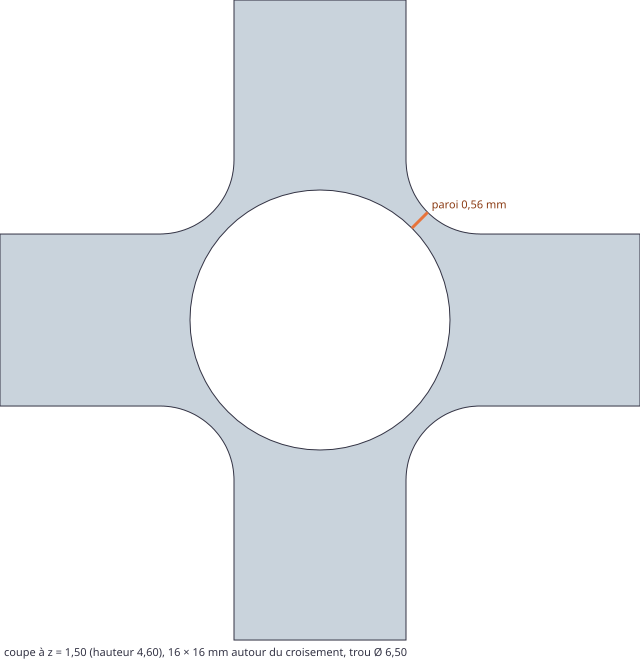

# Banc jetable : logements d'aimants sous les croisements des murets (ticket #24)

> Questions posées :
> - Un trou de 6 × 2 mm plus un jeu, ouvert en dessous, sous le croisement des murets, entaille-t-il le bas des poches ? La pente haute, qui porte le bac, reste-t-elle intacte ?
> - Quelle matière reste autour du trou pour tenir l'aimant, en hybride et en ras, dans une cellule de 42 mm et dans la plus petite (20 mm) ?
> - Aux croisements du bord de la grille, la marge porte-t-elle le trou ? Le cadre et les équerres ne font que 2 mm de haut.
> - Le trou cohabite-t-il avec les coupes, les fentes de clip (#22) et les numéros gravés (#21) ?
>
> Le banc perce ses propres trous dans les baseplates du moteur (`packages/geometry`, avec `magnets: false`), les mesure, puis vérifie que le moteur perce exactement les mêmes (ADR 0012). C'est du code jetable : on ne le reprend pas tel quel.

## Relancer

```bash
# depuis la racine du dépôt (Vitest et manifold-3d du paquet du moteur)
pnpm --filter @repo/geometry exec vitest run --root ../../prototypes/magnets
```

`bench.test.ts` écrit `results.md`, les 3MF et la coupe SVG de `files/`. Il relit chaque 3MF avec le lecteur des tests du moteur, reconstruit chaque objet avec manifold, et s'arrête si un objet n'est pas `NoError`, si un trou tombe même en partie hors de la matière, si de la matière est retirée hors du disque d'un trou, ou si le volume retiré n'est pas exactement celui des trous.

## Réponse

**Le trou ne gêne pas l'assise.** Les aimants restent donc toujours présents, sans option (la règle de repli de la spec ne s'applique pas).



- **Aucune entaille** : autour d'un croisement, le point de poche le plus proche est le milieu de son coin arrondi, à 4·√2 − (4 − retrait) de l'axe. Cela fait 4,51 mm au pied en hybride, et 3,81 mm sur la partie verticale de la poche (retrait 2,15). Le trou de 3,25 mm de rayon y tient tout entier, dans les deux profils, avec des cellules de 42 comme de 20 mm : le croisement ne dépend pas de la taille de la cellule. Le ticket craignait que « le trou de 6,5 mm dépasse le croisement de 5,7 mm au pied » : 5,7 mm est la largeur d'un muret, pas celle du croisement, qui s'élargit dans les coins arrondis des poches.
- **Pente haute intacte** : au-dessus du plafond du trou (2,20 mm), les sections sont identiques à la baseplate sans trou, à 10⁻⁶ mm² près. La pente haute commence plus haut : à 2,85 mm en hybride, à 2,50 mm en ras.
- **Ce qui tient l'aimant** : les quatre murets, pleins jusqu'au croisement suivant, et sur les diagonales une paroi de **0,56 mm** entre le trou et le coin de la poche. Elle court de z = 1,05 à 2,20 mm en hybride (de 0,70 à 2,20 en ras), et s'épaissit en dessous : 0,91 mm à z = 0,70 et 1,26 mm au pied en hybride. C'est une ligne d'extrusion : à juger à l'impression. Elle vaut 0,807 − jeu / 2, soit 0,71 mm avec un jeu de 0,2 (Ø 6,2, comme extrabold) et 0,31 mm avec le jeu maximal de 1 mm.
- **Bord de la grille** : le cadre à traverses et les équerres ne couvrent que 50 % du disque au milieu d'un bord (la moitié côté grille), et 25 % au coin de la grille, au-dessus de leurs 2 mm. Le trou y déboucherait : **pas d'aimant au bord** avec ces marges. Les cellules tronquées prolongent les murets en pleine hauteur : le disque y est couvert à 100 %. Le moteur y met un aimant quand le trou garde au moins un mur (1,2 mm) jusqu'au contour, plus le chanfrein du dessous. À 4 mm de marge, il ne resterait que 0,75 mm : pas d'aimant.
- **Cohabitation** : les trous ne touchent ni les fentes de clip (au milieu des bords, sur les coupes), ni les numéros gravés (au milieu des bords), ni les poches. Le volume retiré est exactement celui des trous. Les croisements coupés n'ont pas d'aimant.

Les tableaux complets sont dans `results.md`. En voici l'essentiel.

### Croisement intérieur (2 × 2 cellules)

| Profil | z (mm) | Retrait (mm) | Coin de poche (mm) | Paroi en diagonale | Entaille | Section retirée |
|---|---|---|---|---|---|---|
| hybride | 0,10 | 2,85 | 4,507 | 1,257 mm | 0 % | 33,130 mm² (le trou) |
| hybride | 0,70 | 2,50 | 4,157 | 0,907 mm | 0 % | 33,130 mm² |
| hybride | 1,50 / 2,10 | 2,15 | 3,807 | **0,557 mm** | 0 % | 33,130 mm² |
| hybride | 2,30 / 2,90 / 3,50 / 4,50 | 2,15 → 0,50 | — | au-dessus du trou | — | 0 : section intacte |
| ras | 0,10 | 2,75 | 4,407 | 1,157 mm | 0 % | 33,130 mm² |
| ras | 0,50 | 2,35 | 4,007 | 0,757 mm | 0 % | 33,130 mm² |
| ras | 1,50 / 2,10 | 2,15 | 3,807 | **0,557 mm** | 0 % | 33,130 mm² |
| ras | 2,30 / 2,60 / 3,50 / 4,10 | 2,15 → 0,55 | — | au-dessus du trou | — | 0 : section intacte |

Mêmes valeurs pour des cellules de 20 mm. Rien n'est perdu hors du disque du trou, à 10⁻⁶ mm² près, à aucune hauteur. Chaque trou retire 72,886 mm³ : le polygone de 64 côtés (33,130 mm²) sur 2,20 mm.

### Croisements du bord (3 × 2 cellules, hybride)

| Marge | Croisement | z = 1,50 | z = 2,10 | Plafond (z = 2,30) | Tenu |
|---|---|---|---|---|---|
| cadre à traverses, 15 mm | milieu du bord | 61,7 % | 50,0 % | 50,0 % | non |
| cadre à traverses, 15 mm | coin de la grille | 48,0 % | 25,0 % | 25,0 % | non |
| équerres, 15 mm | milieu du bord / coin | 50,0 % / 48,0 % | 50,0 % / 25,0 % | 50,0 % / 25,0 % | non |
| cellules tronquées, 15 ou 8 mm | milieu du bord / coin | 100 % | 100 % | 100 % | oui |
| cellules tronquées, 4 mm | milieu du bord / coin | 100 % | 100 % | 100 % | oui, mais 0,75 mm jusqu'au contour : exclu par le moteur |
| sans marge | milieu du bord / coin | 50,0 % / 14,7 % | 50,0 % / 14,7 % | 50,0 % / 14,7 % | non |

### Cohabitation (découpe pour le plateau)

| Cas | Pièces | Clips | Croisements intérieurs | Aimants | Retiré = trous × 72,886 mm³ |
|---|---|---|---|---|---|
| tiroir par défaut, plateau de 256 | 4 | 15 | 40 | 28 | 2 040,80 mm³ |
| tiroir de 150 × 110 en cellules de 20, plateau de 70 | 6 | 17 | 24 | 12 | 874,63 mm³ |

## Fichiers à imprimer pour la recette (#16)

Dans `files/`, en 3MF, fermés (`NoError`). Les bancs 2 × 2 sortent du moteur, qui retire exactement les trous du banc.

| Priorité | Fichier | Contenu | Ce qu'on juge |
|---|---|---|---|
| 1 | `banc-2x2-hybride.3mf` | 2 × 2 cellules en hybride, 1 aimant au centre (Ø 6,5, 2,2 mm) | L'assise : un bac 1 × 1 dans chaque poche, et un bac 2 × 2 sur le croisement percé, sans jeu ni bascule. Le maintien : l'aimant entre-t-il par-dessous, tient-il collé (ou serré), et affleure-t-il sans dépasser ? Le plafond du trou (pont de 6,5 mm) est-il propre ? La paroi de 0,56 mm sur les diagonales s'imprime-t-elle ? |
| 2 | `kit-jeux-aimants.3mf` | 4 croisements de 14 × 14 mm découpés dans la vraie baseplate, trous de Ø 6,1 / 6,2 / 6,3 / 6,5 de gauche à droite | Quel trou tient l'aimant serré sans colle, lequel fend la paroi des diagonales ? Il dira s'il faut un jeu propre aux aimants, plutôt que le jeu des trous (0,5 par défaut). |
| 3 | `banc-2x2-ras.3mf` | le même en profil ras | La même chose : le trou monte à 2,20 mm, la pente haute du ras commence à 2,50 mm. |
| 4 | `banc-2x2-marge-cellules.3mf` | 2 × 2 cellules et 8 mm de marge en cellules tronquées : 9 aimants, dont 8 au bord | Le trou du bord, entre la grille et la marge : garde-t-il son mur jusqu'au contour ? Dans un tiroir en tôle, la baseplate tient-elle ? |

On retrouve les bancs dans le générateur en mode « nombre de cellules », 2 × 2. Pour le 4, choisir la marge « cellules tronquées » avec 16 mm en largeur et en profondeur.
